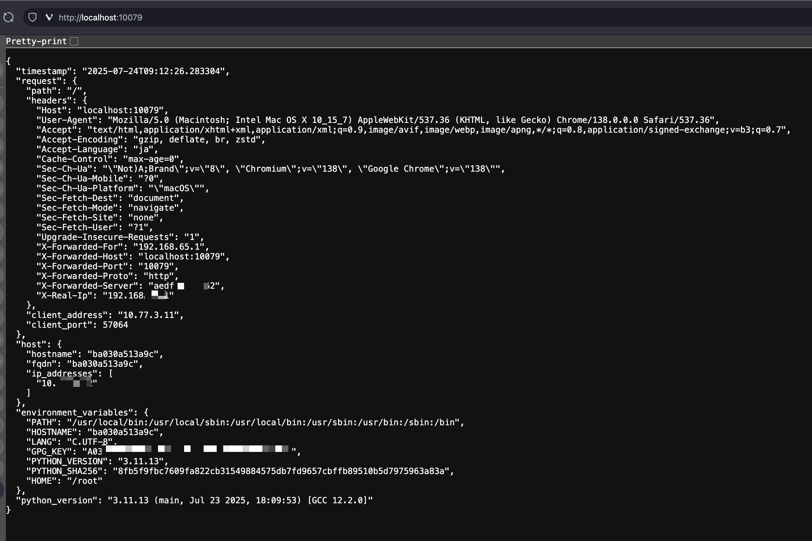

# debug-httpd

コンテナ実行環境のデモやデバッグのための軽量HTTPサーバーです。約6.5MBの超小型Dockerイメージで、コンテナの動作確認、ネットワークのテスト、アプリケーションのデバッグに役立ちます。



## 特徴

- **超軽量**: scratchベースで約6.5MBのDockerイメージ
- **即座に起動**: コンテナの起動確認やヘルスチェックに最適
- **デバッグ機能**: 環境変数、ネットワーク情報、タイムアウトテストなど
- **テスト用途**: 任意のHTTPステータスコードや遅延を返すエンドポイント

## ユースケース

### 🐳 コンテナ環境の検証
- Kubernetes / Docker Compose のデプロイメント確認
- コンテナ間ネットワークの疎通確認
- ロードバランサーやIngressの動作確認

### 🔍 デバッグとトラブルシューティング
- コンテナ内の環境変数やネットワーク設定の確認
- タイムアウト設定のテスト
- エラーハンドリングの動作確認

### 📊 アプリケーションテスト
- ヘルスチェックエンドポイントのモック
- 遅延やエラーレスポンスのシミュレーション
- アクセスログの確認

## クイックスタート

### Docker で実行

```bash
# GitHub Container Registry から実行
docker run -p 9876:9876 ghcr.io/tokuhirom/debug-httpd:latest

# アクセスして確認
curl http://localhost:9876
```

### Kubernetes で実行

```yaml
apiVersion: apps/v1
kind: Deployment
metadata:
  name: debug-httpd
spec:
  replicas: 1
  selector:
    matchLabels:
      app: debug-httpd
  template:
    metadata:
      labels:
        app: debug-httpd
    spec:
      containers:
      - name: debug-httpd
        image: ghcr.io/tokuhirom/debug-httpd:latest
        ports:
        - containerPort: 9876
---
apiVersion: v1
kind: Service
metadata:
  name: debug-httpd
spec:
  selector:
    app: debug-httpd
  ports:
  - port: 80
    targetPort: 9876
```

### ポート設定

```bash
# 環境変数でポートを指定
docker run -p 8080:8080 -e PORT=8080 ghcr.io/tokuhirom/debug-httpd:latest

# コマンドライン引数でポートを指定
docker run -p 8080:8080 ghcr.io/tokuhirom/debug-httpd:latest 8080
```

## エンドポイント

### `GET /` - 環境情報の取得

コンテナの環境情報を JSON 形式で返します。環境変数、ホスト情報、IPアドレスなどの確認に使用します。

**使用例:**
```bash
curl http://localhost:9876 | jq .
```

**レスポンス例:**
```json
{
  "timestamp": "2025-12-19T00:00:00.123456789+09:00",
  "request": {
    "path": "/",
    "headers": {
      "Host": "localhost:9876",
      "User-Agent": "curl/8.1.0"
    },
    "client_address": "172.17.0.1",
    "client_port": 54321
  },
  "host": {
    "hostname": "debug-httpd-5d8f7b-xwz9k",
    "fqdn": "debug-httpd-5d8f7b-xwz9k",
    "ip_addresses": ["10.244.0.15", "::1", "127.0.0.1"]
  },
  "environment_variables": {
    "PATH": "/usr/local/bin:/usr/bin:/bin",
    "HOSTNAME": "debug-httpd-5d8f7b-xwz9k",
    "KUBERNETES_SERVICE_HOST": "10.96.0.1"
  },
  "go_version": "go1.23.0"
}
```

**活用シーン:**
- Kubernetes Podの環境変数確認
- コンテナのIPアドレス確認
- ネットワーク疎通テスト

---

### `GET /ping` - ヘルスチェック

シンプルなヘルスチェックエンドポイント。"pong"というテキストを返します。

**使用例:**
```bash
curl http://localhost:9876/ping
# => pong
```

**活用シーン:**
- Kubernetes の liveness / readiness probe
- ロードバランサーのヘルスチェック
- 監視システムの死活監視

**Kubernetes 設定例:**
```yaml
livenessProbe:
  httpGet:
    path: /ping
    port: 9876
  initialDelaySeconds: 3
  periodSeconds: 5
```

---

### `GET /logs` - アクセスログの取得

直近100件のアクセスログをJSON形式で返します。

**使用例:**
```bash
curl http://localhost:9876/logs | jq .
```

**レスポンス例:**
```json
[
  {
    "timestamp": "2025-12-19T00:00:00.123456789+09:00",
    "method": "GET",
    "path": "/status?code=404",
    "client_address": "10.244.0.1",
    "client_port": 45678,
    "user_agent": "curl/8.1.0",
    "referer": "",
    "host": "localhost:9876"
  }
]
```

**活用シーン:**
- リクエストの履歴確認
- クライアントIPアドレスの確認
- デバッグ時のリクエスト追跡

---

### `GET /sleep?duration=<time>` - タイムアウトのテスト

指定した時間sleepしてからレスポンスを返します。タイムアウト設定のテストに使用します。

**パラメータ:**
- `duration` (必須) - sleep時間（`ns`, `us`, `ms`, `s`, `m`, `h` の単位をサポート、最大1時間）

**使用例:**
```bash
# 1秒待機
curl http://localhost:9876/sleep?duration=1s

# 500ミリ秒待機
curl http://localhost:9876/sleep?duration=500ms

# 3秒待機してタイムアウトをテスト
curl --max-time 2 http://localhost:9876/sleep?duration=3s
# => タイムアウトエラー
```

**レスポンス例:**
```json
{
  "slept_duration": "1s",
  "actual_duration": "1.000123456s",
  "timestamp": "2025-12-19T00:00:01.123456789+09:00"
}
```

**活用シーン:**
- リバースプロキシのタイムアウト設定確認
- アプリケーションのタイムアウトハンドリングテスト
- 遅いAPIのシミュレーション

---

### `GET /status?code=<code>` - HTTPステータスコードのテスト

任意のHTTPステータスコードを返します。エラーハンドリングのテストに使用します。

**パラメータ:**
- `code` (必須) - HTTPステータスコード（100-599）

**使用例:**
```bash
# 404 Not Found を返す
curl -i http://localhost:9876/status?code=404

# 500 Internal Server Error を返す
curl -i http://localhost:9876/status?code=500

# 503 Service Unavailable を返す（サービス停止のシミュレーション）
curl -i http://localhost:9876/status?code=503
```

**レスポンス例:**
```json
{
  "status_code": 404,
  "message": "Not Found",
  "timestamp": "2025-12-19T00:00:00.123456789+09:00"
}
```

**活用シーン:**
- エラーハンドリングのテスト
- リトライロジックの動作確認
- 監視システムのアラートテスト

## 実用例

### 1. Kubernetes でのデプロイメント確認

```bash
# デプロイ
kubectl apply -f deployment.yaml

# Pod情報の確認
kubectl port-forward deployment/debug-httpd 9876:9876

# 環境変数とIPアドレスの確認
curl http://localhost:9876 | jq '.host, .environment_variables'
```

### 2. タイムアウト設定のテスト

```bash
# Nginxのproxy_read_timeoutが5秒の場合
curl http://your-nginx-proxy/sleep?duration=3s  # 成功
curl http://your-nginx-proxy/sleep?duration=6s  # タイムアウト
```

### 3. ロードバランサーのヘルスチェック設定

```bash
# ヘルスチェックエンドポイントの動作確認
watch -n 1 'curl -s http://localhost:9876/ping'

# エラーレスポンスのシミュレーション（ヘルスチェック失敗）
curl http://localhost:9876/status?code=503
```

### 4. アクセスログの確認

```bash
# 複数のリクエストを送信
for i in {1..5}; do curl http://localhost:9876/status?code=$((200 + i)); done

# ログの確認
curl http://localhost:9876/logs | jq '.[-5:]'
```

## ローカル開発

### ビルドとテスト

```bash
# ユニットテストを実行
make test

# 統合テスト（Dockerが必要）を実行
make integration-test

# 全てのテストを実行
make test-all

# ローカルでバイナリをビルドして実行
make build
make run
```

### Dockerイメージのビルド

```bash
# イメージをビルド
docker build -t debug-httpd:latest .

# ローカルで実行
docker run -p 9876:9876 debug-httpd:latest
```

## CI/CD

GitHub Actions により自動化されています：
- プルリクエスト時にユニットテストと統合テストを実行
- main ブランチへのプッシュ時に Docker イメージをビルドし、GitHub Container Registry (ghcr.io) に自動プッシュ

最新のイメージは常に `ghcr.io/tokuhirom/debug-httpd:latest` で利用可能です。

## ライセンス

```
The MIT License (MIT)

Copyright © 2025 Tokuhiro Matsuno, http://64p.org/ <tokuhirom@gmail.com>

Permission is hereby granted, free of charge, to any person obtaining a copy
of this software and associated documentation files (the "Software"), to deal
in the Software without restriction, including without limitation the rights
to use, copy, modify, merge, publish, distribute, sublicense, and/or sell
copies of the Software, and to permit persons to whom the Software is
furnished to do so, subject to the following conditions:

The above copyright notice and this permission notice shall be included in
all copies or substantial portions of the Software.

THE SOFTWARE IS PROVIDED "AS IS", WITHOUT WARRANTY OF ANY KIND, EXPRESS OR
IMPLIED, INCLUDING BUT NOT LIMITED TO THE WARRANTIES OF MERCHANTABILITY,
FITNESS FOR A PARTICULAR PURPOSE AND NONINFRINGEMENT. IN NO EVENT SHALL THE
AUTHORS OR COPYRIGHT HOLDERS BE LIABLE FOR ANY CLAIM, DAMAGES OR OTHER
LIABILITY, WHETHER IN AN ACTION OF CONTRACT, TORT OR OTHERWISE, ARISING FROM,
OUT OF OR IN CONNECTION WITH THE SOFTWARE OR THE USE OR OTHER DEALINGS IN
THE SOFTWARE.
```
